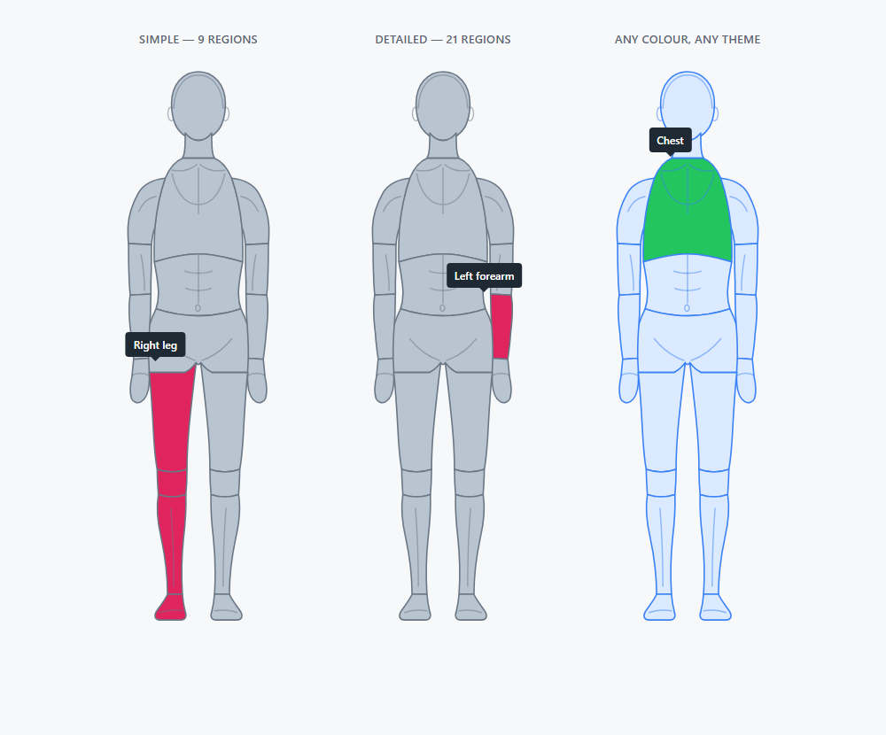

# Interactive Body Map

A clickable diagram of the human body. Every region — head, neck, chest,
abdomen, pelvis, arms and legs — links to any URL you choose.

Ships in two forms from one codebase:

| | |
|---|---|
| [`js-version/`](js-version/) | Drop-in HTML, CSS and JavaScript for any website |
| [`wordpress-plugin/`](wordpress-plugin/interactive-body-map/) | Installable WordPress plugin with a settings screen, a shortcode and a block |



## What it does

- **Every part links anywhere.** Internal pages, external sites, `mailto:` and
  `tel:`, with an optional new tab per region.
- **Two levels of detail.** Simple mode gives 9 regions. Detailed mode splits
  the limbs into shoulder, upper arm, forearm and hand, and thigh, knee, lower
  leg and foot — 21 in all.
- **Transparent background.** The figure paints no background of its own, so it
  sits directly on your page colour, photo or gradient.
- **Responsive and resizable.** Vector artwork. Set one maximum width; it scales
  to any screen without going soft.
- **Desktop and touch.** Hover effects are gated behind
  `@media (hover: hover)`, so a tap never leaves a region stuck highlighted.
  Tested on iPhone, iPad, Android phones and tablets.
- **Real links, good for SEO.** Each region is a genuine `<a href>`. The
  WordPress plugin prints the whole figure server-side, so crawlers see plain
  HTML anchors and visitors see the diagram before any script has run.
- **Keyboard and screen reader friendly.** Tab moves between regions in
  anatomical order, Enter follows the link, and every region carries a label.
- **Small.** 5.7 KB of JavaScript and 1.2 KB of CSS, gzipped. No dependencies,
  no images, no web fonts, no network requests.

## Quick start

### Any website

```html
<link rel="stylesheet" href="css/body-map.css">

<div data-body-map
     data-part-head="/conditions/head"
     data-part-chest="/conditions/chest"
     data-part-arms="/conditions/arms"
     data-part-legs="/conditions/legs"></div>

<script src="js/body-map.min.js"></script>
```

That is the whole integration. Open [`js-version/index.html`](js-version/index.html)
for the live demo and the full option reference.

### WordPress

1. **Plugins → Add New → Upload Plugin**, choose
   `dist/interactive-body-map-wordpress-1.0.0.zip`, activate.
2. **Settings → Body Map**, give each part of the body a link.
3. Add the **Body Map** block, or paste `[body_map]` anywhere.

## Repository layout

```
js-version/                      the standalone component - the source of truth
  index.html                     demo and documentation
  demo-simple.html               smallest possible integration
  css/body-map.css          readable stylesheet
  css/body-map.min.css      minified
  js/body-map.js            readable script
  js/body-map.min.js        minified

wordpress-plugin/interactive-body-map/
  interactive-body-map.php  plugin header and bootstrap
  includes/
    class-bodymap-geometry.php       GENERATED from the JavaScript - do not edit
    class-bodymap-model.php          regions, modes and link fallbacks
    class-bodymap-render.php         server-side SVG output
    class-bodymap-settings.php       Settings > Body Map
    class-bodymap-shortcode.php      [body_map]
    class-bodymap-block.php          the block
  admin/                         settings and block editor assets
  assets/                        SYNCED from js-version - do not edit
  languages/                     GENERATED translation template

docs/                            installation and region reference
test/                            render tests
build.mjs                        minify, generate, sync
package.mjs                      build the two customer zips
```

### The two distributions never drift

`js-version/` is the only place the figure is defined. `build.mjs` reads the
geometry straight out of the JavaScript, generates `class-bodymap-geometry.php`
from it, and copies the built assets into the plugin. The test suite then
renders the plugin's PHP and asserts, path by path, that it draws the same
figure the script does.

## Working on it

```bash
npm install          # esbuild, the only dependency, and only for building
npm run build        # minify, generate the PHP geometry and the POT, sync
npm test             # render the plugin's PHP and compare it to the script
npm run package      # build, then produce both customer zips in dist/
```

`npm test` needs PHP on your `PATH`. It stubs WordPress rather than needing an
install, so it runs in about a second.

**After changing anything in `js-version/`, run `npm run build`.** The plugin's
`assets/` and `includes/class-bodymap-geometry.php` are generated; editing them
directly means losing the change on the next build.

## Documentation

- [Installation](docs/INSTALL.md) — both distributions, in detail
- [Region reference](docs/PARTS.md) — every region ID and the fallback rules
- [`js-version/index.html`](js-version/index.html) — options, methods, styling

## Licence

[MIT](LICENSE). Free to use, modify and redistribute, including commercially,
provided the copyright notice and licence text are kept.
